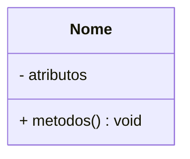
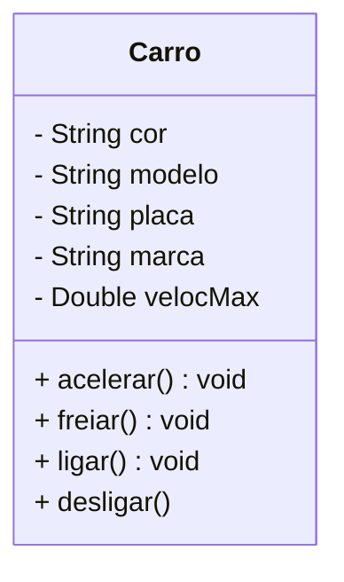
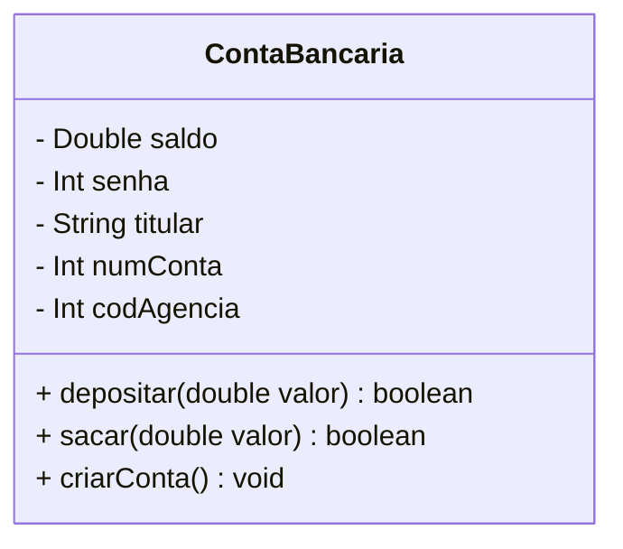
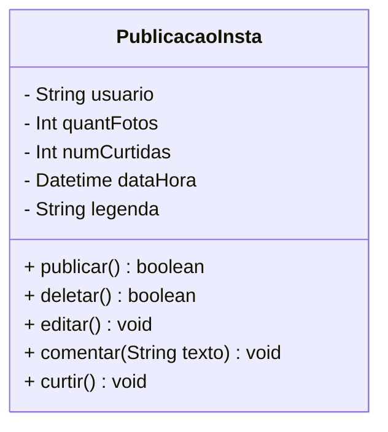
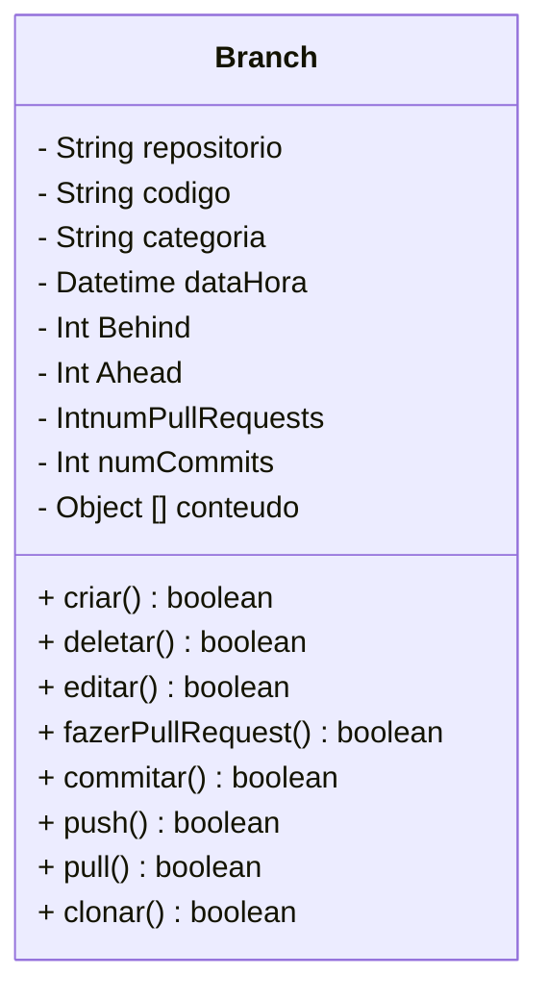

# Exercício de Abstração

Diagramas de classe são utilizados para representar os objetos que irão compor um sistema.

Veja abaixo um exemplo de uma Classe representada em diagrama:

1. Modele uma classe que represente um carro.

2. Modele uma classe que represente uma Conta Bancária.

3.Modele uma classe que represente um Post (de rede social).

4.Modele uma classe que represente uma Branch.

